# DocuSync — Complete Architecture

A fully local document intelligence system: **upload → parse → embed → tag → semantically search**, with zero cloud APIs. All models (embeddings, reranker, summarizer, classifier, OCR) run on your own machine or GPU.

---

## 1. System overview

| Dimension | Answer |
|---|---|
| **Purpose** | Ingest PDF/DOCX/TXT/MD/JSON documents and make them searchable by meaning, keyword, and tag |
| **Language / runtime** | Python 3.11+, async FastAPI + Uvicorn |
| **Frontend** | React 19 + Vite 8 SPA, served by the same FastAPI process |
| **Storage** | SQLite (metadata + FTS5 full-text), ChromaDB (vector store), filesystem (uploads) |
| **Compute** | Local CPU / Apple MPS / NVIDIA CUDA (auto-selected) |
| **Deployment** | Docker (GPU image), docker-compose, nginx, GitHub Actions CI/CD → GHCR |
| **Data locality** | 100 % local — no external AI service is required |

### 1.1 High-level component diagram

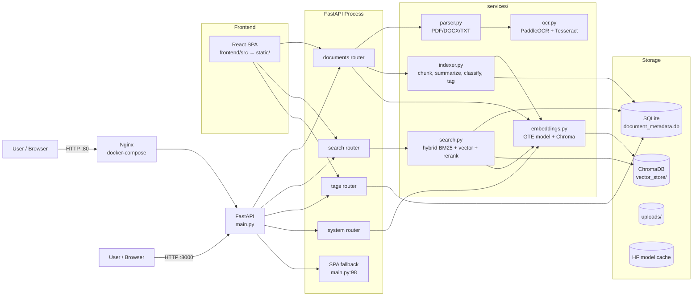

---

## 2. Tech stack

| Component | Technology | Module |
|---|---|---|
| API server | FastAPI + Uvicorn | `main.py` |
| Config | env-var driven, `dataclass`-free module constants | `core/config.py` |
| Database | SQLite (WAL mode) + FTS5 virtual table | `core/db.py` |
| PDF parsing | PyMuPDF (`fitz`): reading-order extraction, `find_tables()` | `services/parser.py` |
| DOCX parsing | python-docx (paragraphs + interleaved tables) | `services/parser.py` |
| OCR (primary) | PaddleOCR PP-OCRv4 mobile / PP-OCRv5/v6 server on GPU | `services/ocr.py` |
| OCR (fallback) | Tesseract 5, PSM 11 sparse-text mode | `services/ocr.py` |
| OCR (remote, optional) | Colab PP-OCRv5 server via Cloudflare tunnel | `services/ocr.py` |
| Embeddings | Alibaba-NLP/gte-large-en-v1.5 (sentence-transformers) | `services/embeddings.py` |
| Vector store | ChromaDB, persistent, cosine HNSW | `services/embeddings.py` |
| Keyword search | SQLite FTS5, porter tokenizer, BM25 | `services/search.py` |
| Query expansion | YAKE statistical keyphrases | `services/search.py` |
| Reranking | Alibaba-NLP/gte-reranker-modernbert-base cross-encoder | `services/search.py` |
| Summarization | facebook/bart-large-cnn (DistilBART fallback path) | `services/indexer.py` |
| Classification | MoritzLaurer/DeBERTa-v3-large NLI zero-shot | `services/indexer.py` |
| LLM tagging (optional) | Google Gemini API / Ollama (`LLM_PROVIDER=gemini`) | `services/indexer.py` |
| Keyword extraction | YAKE → mini-KeyBERT → TF-IDF → raw-TF (cascade) | `services/indexer.py` |
| Frontend | React 19, Vite 8, Tailwind 4, lucide-react, Tabler icons | `frontend/` |

### 2.1 Model stack

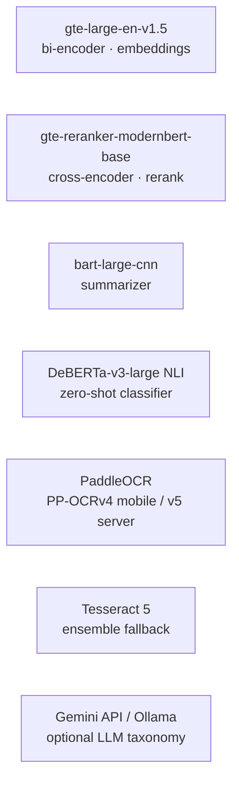

---

## 3. Project structure

```
.
├── main.py                  # FastAPI app, lifespan, SPA fallback (entry point)
├── core/                    # Runtime config + SQLite schema/migrations
│   ├── config.py            # All env-driven settings, path setup
│   ├── db.py                # Connection factory, schema v1→v6 migrations
│   └── embeddings.py        # Chroma client + collection singletons
├── services/                # Business logic
│   ├── parser.py            # Text + table extraction (PDF/DOCX/TXT)
│   ├── ocr.py               # OCR engines + reading-order reconstruction
│   ├── indexer.py           # Chunking, summarization, classification, tagging
│   ├── embeddings.py        # GTE model loading + Chroma wrapper
│   └── search.py            # Hybrid retrieval + RRF fusion + reranking
├── routes/                  # API route modules
│   ├── documents.py         # upload/list/status/text/download/delete/retry
│   ├── search.py            # POST /search
│   ├── tags.py              # /tags, /tags/perspectives, /tags/config
│   └── system.py            # /health, /reset, /retag, /retag-ai, /migrate-to-cosine
├── frontend/                # React 19 + Vite 8 SPA source
│   └── src/
│       ├── App.jsx          # Single-page app (lib / search / tags views)
│       ├── lib/api.js       # fetch wrappers for every backend endpoint
│       └── components/      # DocModal, FileItem, Inspector, etc.
├── static/                  # Built SPA (npm run build output, served by FastAPI)
├── uploads/                 # Uploaded files (runtime, gitignored)
├── vector_store/            # ChromaDB data (runtime, gitignored)
├── document_metadata.db     # SQLite database (runtime, gitignored)
├── scripts/retag_scifact.py # Batch re-tagging utility
├── requirements.txt
├── Dockerfile               # Multi-stage: node build → paddle GPU runtime
├── docker-compose.yml       # Dev/prod compose (GPU + nginx)
├── docker-compose.prod.yml  # Production compose (GHCR image, /opt/docusync)
├── deploy_to_server.sh      # rsync + systemd-less manual deploy
└── .github/workflows/       # ci.yml, docker-publish.yml, deploy.yml
```

---

## 4. Runtime data flow — end to end

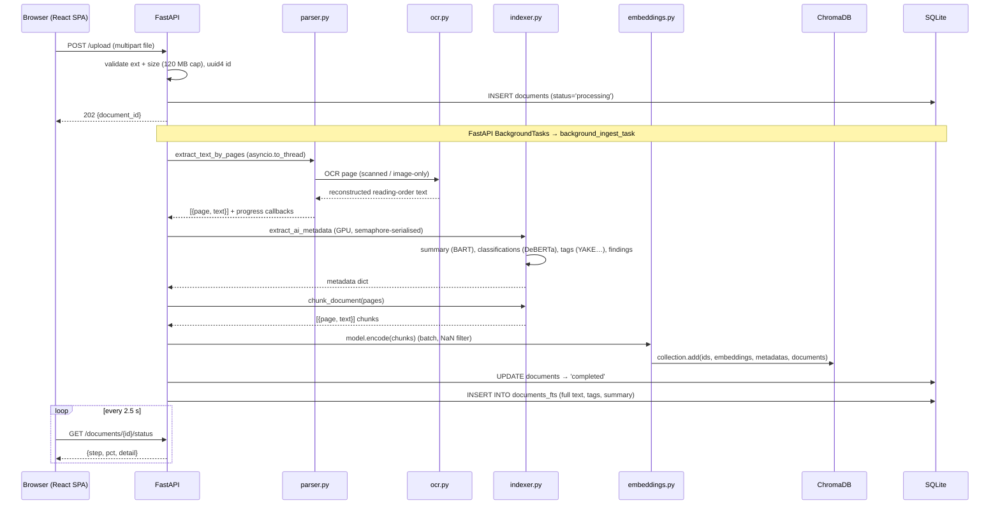

---

## 5. Ingestion pipeline (deep dive)

### 5.1 Upload → parse

```mermaid
flowchart TD
    UP[POST /upload] --> EXT{extension allowed?}
    EXT -- no --> 400[400 Unsupported format]
    EXT -- yes --> SAVE[Stream to uploads/{uuid}{ext}]
    SAVE --> SIZE{size ≤ 120 MB?}
    SIZE -- no --> 413[413 File too large]
    SIZE -- yes --> DB[INSERT documents<br/>status=processing]
    DB --> BG[BackgroundTasks<br/>background_ingest_task]
    BG --> STAGE[Stage 1 · parsing<br/>progress 5→65%]
    STAGE --> AI[Stage 2 · AI metadata<br/>semaphore(3) · progress 65%]
    AI --> CHUNK[Stage 3 · chunking<br/>progress 70%]
    CHUNK --> EMB[Stage 4 · embedding<br/>progress 76%]
    EMB --> SAVE2[Stage 5 · Chroma write<br/>progress 93%]
    SAVE2 --> SQL[Stage 6 · persist SQLite<br/>progress 97%]
    SQL --> DONE[status='completed']

    BG -->|failure| FAIL[UPDATE status='failed'<br/>error_message]
```

**Key behaviours:**
- Progress is tracked **in memory** (`_ingest_progress` dict) and exposed via `GET /documents/{id}/status` for UI polling — it resets on restart, the DB row is the source of truth.
- GPU inference is serialised through `asyncio.Semaphore(3)` to avoid MPS/CUDA "meta tensor" errors when DeBERTa + BART load concurrently (`routes/documents.py:35`).
- Stuck documents older than 2 h are auto-marked `failed` on startup (`core/db.py:200`).
- `POST /documents/{id}/retry` re-queues a failed doc from the still-on-disk original.

### 5.2 Parsing (parser.py)

```mermaid
flowchart LR
    F[file] --> TYPE{extension}
    TYPE -->|.pdf| PDF[PyMuPDF per-page]
    TYPE -->|.docx| DOCX[python-docx walk XML body]
    TYPE -->|.txt/.md/.json| TXT[read + 2000-char page split]

    PDF --> ORD[reading-order sort<br/>horizontal bands]
    ORD --> NORM[normalise: ligatures, NFKC,<br/>hyphen repair, whitespace]
    PDF --> TAB[find_tables → markdown rows]
    NORM --> PAGES[{page, text}]

    DOCX --> DBLK[paragraphs + table rows<br/>in body order]
    DBLX --> DBLK --> NORM

    TXT --> TXTSPLIT[2000-char chunks]
    TXTSPLIT --> PAGES
```

**PDF handling details:**
- **Reading order** — text blocks sorted into horizontal bands (`~75% of avg line height`) then left→right, fixing two/three-column layouts (`parser.py:109`).
- **Structured tables** — `find_tables()` emits pipe-delimited markdown rows (≥2 rows × ≥2 cols) appended after page text (`parser.py:137`).
- **Scanned pages** (no selectable text) — OCR path: try embedded images first, fall back to full-page render (`parser.py:303`).
- **Text pages with figures** — OCR embedded images only if they look like figures (<60% of page area) (`parser.py:340`).
- **Adaptive DPI** — all-image PDFs >10 pages are probed (first 5) and rendered at 150 DPI instead of 300 (`parser.py:255`).
- **Text normalisation** — ligature table, NFKC, `-\n` hyphen repair, whitespace collapse (`parser.py:87`). Critical for search correctness on PDF-extracted text.

### 5.3 OCR (ocr.py)

```mermaid
flowchart TD
    IMG[image bytes] --> COL{COLAB_OCR_URL set?}
    COL -- yes --> COLAP[POST to Colab PP-OCRv5<br/>60 s timeout]
    COLAP -->|unreachable| PAD
    COL -- no --> PAD[Local PaddleOCR<br/>det + rec mobile models]
    PAD --> REC[reconstruct reading order<br/>Y-band rows → X-sort cells → ' | ' join]
    REC --> DENS{density < 5 chars/10k px<br/>AND image > 50k px?}
    DENS -- yes --> TES[Tesseract PSM 11<br/>greyscale→contrast→binarise]
    TES --> PICK[return denser result]
    DENS -- no --> PICK
    PAD -->|import/load failure| TES
```

**Design decisions:**
- PP-OCRv4 **mobile** models (det + rec only) — ~10× smaller than server models, >97 % char accuracy on clean print (`ocr.py:4`).
- Orientation classification and unwarping are **disabled** — PDF pages are already correctly oriented; this avoids downloading 3 extra models (`ocr.py:13`).
- Thread-safe lazy singleton + startup warm-up so the first upload isn't penalised (`ocr.py:89`, `main.py:58`).
- **Ensemble quality gate** — if PaddleOCR returns sparse text (density <5 chars/10k px), Tesseract PSM 11 also runs and the denser result wins (`ocr.py:353`).
- **Reading-order reconstruction** — detection polygons are clustered into Y-rows then X-sorted, producing `Code | Subject | Date | Session` lines instead of disjoint cells (`ocr.py:139`).
- Images capped to 1920 px long-side before OCR (~8 s vs ~30 s/page, no accuracy loss ≥10 pt) (`parser.py:18`).

### 5.4 AI metadata extraction (indexer.py)

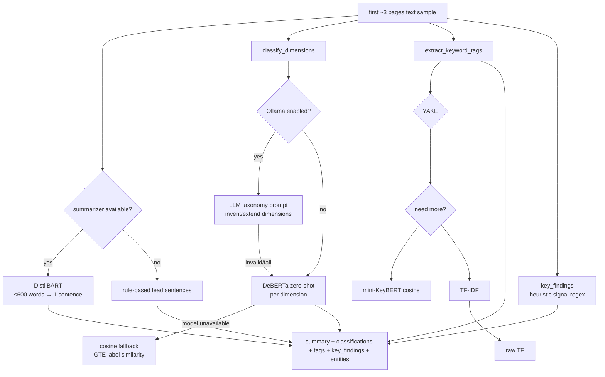

- **Summary** — BART abstractive with rule-based lead-sentence fallback (`indexer.py:572`, `:257`).
- **Classifications** — *dynamic taxonomy*: dimensions stored in `taxonomy_dimensions` / `taxonomy_categories`. With Ollama enabled, an LLM invents new dimensions/categories on the fly and persists them; otherwise DeBERTa NLI scores each dimension's labels against thresholds (`subject>0.35`, `methodology>0.28`, `doc_type>0.40`) (`indexer.py:634`). Cosine-similarity fallback if DeBERTa is unavailable.
- **Tags** — cascade of YAKE → mini-KeyBERT → TF-IDF → raw TF, excluding labels already present in the taxonomy sidebar (`indexer.py:146`).
- **Key findings** — regex on high-signal policy/deadline/grading terms (`indexer.py:785`).
- Classifier config is versioned via a **signature string**; a mismatch at startup warns the user to run `POST /retag-ai` (`indexer.py:525`).

### 5.5 Chunking (indexer.py)

```mermaid
flowchart TD
    PAGES[{page, text}] --> T{_is_tabular_text?}
    T -- yes --> ROWS[group 15 rows/chunk, 2-row overlap]
    T -- no --> SENT[sentence-boundary split<br/>' . ' + paragraph breaks]
    SENT --> SZ{add sentence > target 900?}
    SZ -- yes --> OVF[flush + character-split<br/>chunk_size-100 stride]
    SZ -- no --> APP[append<br/>2-sentence overlap carry-forward]
    ROWS --> FINAL[drop chunks < 20 chars]
    SENT --> FINAL
```

- `chunk_size = 900`, `overlap_sentences = 2` — sentence-level sliding overlap keeps context across chunk boundaries.
- **Tabular pages** detected heuristically (≥6 lines, avg <100 chars, <15 % sentence punctuation, ≥30 % short-token line starts) and chunked **by rows**, never mid-row (`indexer.py:332`).
- Oversized single sentences are character-split so no chunk exceeds ~1.5× target (`indexer.py:430`).

### 5.6 Embedding + vector index (embeddings.py)

- **Device selection** — `cuda` → `mps` → `cpu` at load time (`embeddings.py:18`).
- GTE-large-en-v1.5 bi-encoder, batch size 32 (env `EMBEDDING_BATCH_SIZE`).
- ChromaDB **PersistentClient** at `vector_store/`, collection `document_chunks`, `hnsw:space=cosine`.
- Chunks stored with `document_id` + `page` metadata; NaN/Inf embeddings dropped before insert (`routes/documents.py:135`).
- Model-version mismatch is detected at startup (`check_model_version_match`) — if the embedding model changed, existing vectors are flagged stale and `POST /migrate-to-cosine` or `POST /reset` is recommended (`indexer.py:496`).

---

## 6. Search pipeline (deep dive)

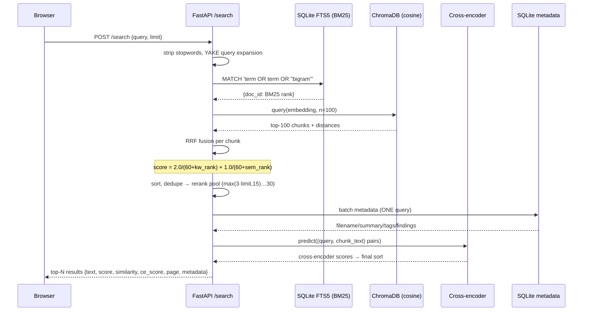

### 6.1 Hybrid retrieval — Weighted Reciprocal Rank Fusion

```mermaid
flowchart LR
    Q[query] --> KW[BM25 keyword ranks<br/>FTS5 porter]
    Q --> SEM[semantic ranks<br/>Chroma cosine]

    KW --> RRF{Weighted RRF}
    SEM --> RRF
    RRF --> F[score = KWW/(K+kw_rank)<br/>+ SSW/(K+sem_rank)]
    F --> POOL[rerank pool 15–30]
    POOL --> CE[Cross-encoder<br/>GTE-Reranker]
    CE --> OUT[final top-N]
```

| Component | Parameters |
|---|---|
| RRF constant `K` | 60 |
| Keyword weight | `RRF_KW_WEIGHT` (default `2.0`) |
| Semantic weight | `RRF_SEM_WEIGHT` (default `1.0`) |
| Env override | `RRF_KW_WEIGHT=… RRF_SEM_WEIGHT=…` |

Rationale (documented in code): BM25 achieves 92 % R@1 vs 64 % semantic on identifier-heavy corpora (course codes, names), so BM25 gets 3× the weight by default (`services/search.py:92`).

- **Query expansion** — for ≥4-word queries YAKE extracts salient bigrams added as phrase terms (`search.py:127`).
- **Query embedding caching** — `@lru_cache(maxsize=512)` on identical queries (`search.py:196`).
- **Reranking** is two-stage: fast approximate retrieval (top-100 vector + BM25) then exact cross-encoder over a tight pool of 15–30 chunks — the canonical retrieve-then-rerank architecture (Azure Semantic Ranker, Cohere Rerank, Kendra, Vertex AI).

---

## 7. Data model

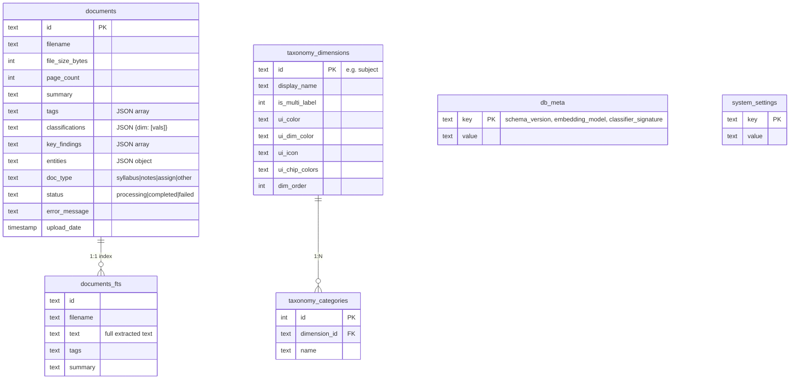

### 7.1 Schema migrations

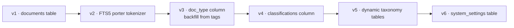

- SQLite runs in **WAL mode** with `synchronous=NORMAL` (`core/db.py:21`).
- On Python <3.9 / old sqlite, `pysqlite3-binary` is swapped in for Chroma compatibility (`core/db.py:9`).
- **Vector ↔ metadata consistency**: `document_id` in Chroma equals `documents.id`; delete/reset remove from both SQLite (`documents`, `documents_fts`) and Chroma together.

---

## 8. API surface

| Endpoint | Method | Purpose | Route module |
|---|---|---|---|
| `/upload` | POST | Upload + start background ingestion | `routes/documents.py:208` |
| `/documents` | GET | List, filter by `type`/`tag`/`dimension`/`value` | `routes/documents.py:251` |
| `/documents/counts` | GET | Sidebar badges (indexed/queued/failed) | `routes/documents.py:299` |
| `/documents/{id}/status` | GET | Live ingestion progress polling | `routes/documents.py:320` |
| `/documents/{id}/text` | GET | Full indexed text | `routes/documents.py:343` |
| `/documents/{id}/insights` | GET | Extracted key-insight sentences | `routes/documents.py:354` |
| `/documents/{id}/download` | GET | Serve original file | `routes/documents.py:379` |
| `/documents/{id}` | DELETE | Remove from SQLite + FTS + Chroma + disk | `routes/documents.py:396` |
| `/documents/{id}/retry` | POST | Re-ingest a failed doc | `routes/documents.py:425` |
| `/search` | POST | Hybrid search `{query, limit}` | `routes/search.py:19` |
| `/tags` | GET | Flat tag counts + dimension hierarchy | `routes/tags.py:62` |
| `/tags/config` | GET | Dimension UI config (colors/icons/order) | `routes/tags.py:53` |
| `/tags/perspectives` | GET | Sidebar classification tree | `routes/tags.py:136` |
| `/health` | GET | Storage/model/limits status | `routes/system.py:36` |
| `/reset` | POST | Wipe all data | `routes/system.py:68` |
| `/retag` | POST | Rule-based re-tagging (`force` flag) | `routes/system.py:97` |
| `/retag-ai` | POST | Background DeBERTa re-classification | `routes/system.py:170` |
| `/classifier-status` | GET | Signature drift check | `routes/system.py:151` |
| `/migrate-to-cosine` | POST | In-place L2 → cosine migration | `routes/system.py:243` |
| `/{full_path:path}` | GET | SPA static fallback (served last) | `main.py:98` |

### 8.1 Frontend ↔ backend contract

```mermaid
flowchart LR
    subgraph React SPA
        APP[App.jsx]
        API[lib/api.js]
    end
    API -->|fetchDocuments| D[GET /documents]
    API -->|fetchTags| T[GET /tags]
    API -->|fetchTagsConfig| TC[GET /tags/config]
    API -->|fetchPerspectives| P[GET /tags/perspectives]
    API -->|fetchCounts| C[GET /documents/counts]
    API -->|uploadFile| U[POST /upload]
    API -->|searchDocuments| S[POST /search]
    API -->|fetchDocumentStatus| ST[GET /documents/{id}/status]
    API -->|fetchDocumentText| TX[GET /documents/{id}/text]
    API -->|fetchDocumentInsights| IN[GET /documents/{id}/insights]
    API -->|deleteDocument| DEL[DELETE /documents/{id}]
    API -->|downloadUrl| DW[GET /documents/{id}/download]
```

Frontend views: **Library** (`lib`), **Search**, **Tag directory** (`tags`). Polling: global refresh every 5 s; per-document progress every 2.5 s while `status === 'processing'` (`App.jsx:166`, `:179`).

---

## 9. Startup lifecycle

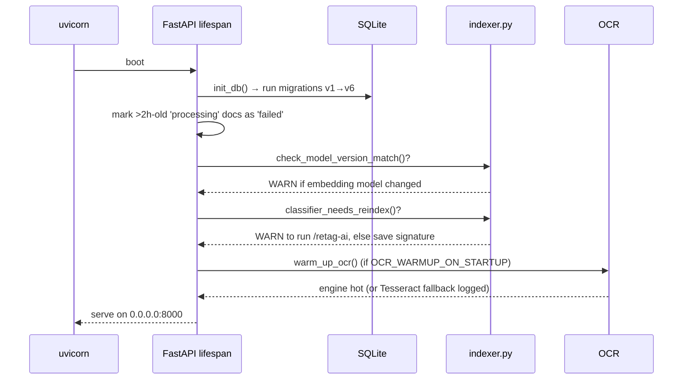

---

## 10. Deployment architecture

### 10.1 Docker image

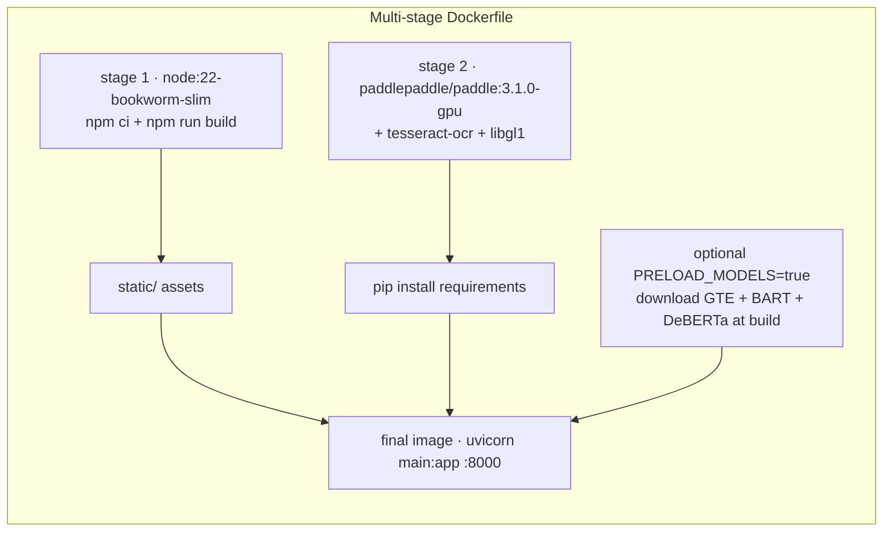

- Base image bundles **paddlepaddle-gpu** (CUDA 12.6 / cuDNN 9.5) — no pip reinstall needed.
- `HEALTHCHECK` hits `/health` every 30 s (`Dockerfile:69`).
- Model cache optional at build time via `PRELOAD_MODELS` build-arg.

### 10.2 Runtime topology

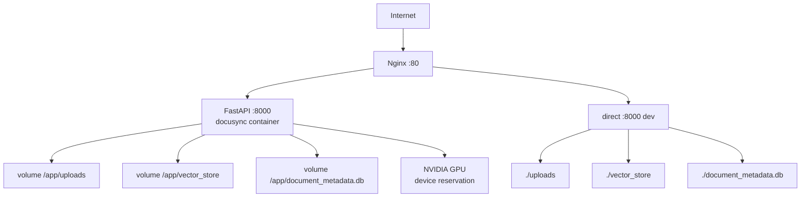

| Compose file | Image | Data location | Port |
|---|---|---|---|
| `docker-compose.yml` | local build | `./uploads`, `./vector_store`, `./document_metadata.db` | 8000 + nginx 80 |
| `docker-compose.prod.yml` | `ghcr.io/rizwanahamed13/docusync:latest` | `/opt/docusync/data/*` | `${APP_PORT:-80} → 8000` |

### 10.3 CI/CD

```mermaid
flowchart LR
    subgraph CI [ci.yml · on push/PR]
        B1[python -m compileall backend]
        B2[npm ci + npm run build]
        B3[docker build (PR only)]
    end

    subgraph PUB [docker-publish.yml · on push main / tags]
        D1[login GHCR] --> D2[metadata tags<br/>branch + sha- + latest] --> D3[build & push]
    end

    subgraph DEP [deploy.yml · manual workflow_dispatch]
        E1[scp docker-compose.prod.yml] --> E2[ssh: compose pull] --> E3[compose up -d]
    end

    CI --> PUB --> DEP
```

- **CI** — backend compile, frontend build, Docker build validation (`ci.yml`).
- **Docker Publish** — pushes branch, tag, `sha-*`, and `latest` to GHCR (`docker-publish.yml`).
- **Deploy** — manual, SSH via `DOCUSYNC_SSH_HOST/USER/KEY` secrets, runs `docker-compose.prod.yml` (`deploy.yml`).
- **`deploy_to_server.sh`** — alternative rsync-based deploy to a bare server: syncs code (excluding data dirs), installs deps, kills & restarts uvicorn under `nohup`, then reports GPU state via `nvidia-smi`.

---

## 11. Cross-cutting concerns

### 11.1 Concurrency & locking

| Concern | Mechanism | Location |
|---|---|---|
| GPU inference serialisation | `asyncio.Semaphore(3)` | `routes/documents.py:35` |
| BART lazy load | `threading.Lock` + double-checked lock | `services/indexer.py:40` |
| DeBERTa lazy load | `threading.Lock` + double-checked lock | `services/indexer.py:66` |
| OCR engine init | `threading.Lock` + double-checked lock | `services/ocr.py:85` |
| Retag re-entrancy | global `_retag_running` flag | `routes/system.py:167` |
| SQLite writes | WAL mode, 30 s timeout | `core/db.py:23` |
| Search embedding cache | `lru_cache(maxsize=512)` | `services/search.py:196` |

### 11.2 Configuration matrix (env vars)

| Variable | Default | Purpose |
|---|---|---|
| `APP_PORT` | 80 | Uvicorn bind port |
| `DOCUSYNC_UPLOAD_DIR` | `./uploads` | Uploaded files |
| `DOCUSYNC_VECTOR_DIR` | `./vector_store` | ChromaDB data |
| `DOCUSYNC_DB_PATH` | `./document_metadata.db` | SQLite file |
| `MAX_UPLOAD_SIZE_MB` | 120 | Upload cap |
| `MAX_CHUNKS_PER_DOC` | 2000 | Chunk cap per doc |
| `OCR_WARMUP_ON_STARTUP` | true | Pre-load OCR at boot |
| `EMBEDDING_MODEL` | gte-large-en-v1.5 | Bi-encoder |
| `RERANKER_MODEL` | gte-reranker-modernbert-base | Cross-encoder |
| `SUMMARIZER_MODEL` | bart-large-cnn | Summarizer |
| `CLASSIFIER_MODEL` | DeBERTa-v3-large NLI | Zero-shot classifier |
| `EMBEDDING_BATCH_SIZE` | 32 | Embedding batch |
| `LLM_PROVIDER` | `gemini` | LLM Provider (`gemini`, `ollama`, or `none`) |
| `GEMINI_API_KEY` | "" | Free Google Gemini API Key |
| `GEMINI_MODEL` | `gemini-2.5-flash` | Google Gemini model name |
| `USE_OLLAMA_TAGGING` | false | Enable Ollama LLM taxonomy (legacy) |
| `OLLAMA_BASE_URL` | `http://127.0.0.1:11434` | Ollama endpoint |
| `OLLAMA_MODEL` | "" | Specific Ollama model |
| `COLAB_OCR_URL` | "" | Remote Colab PP-OCRv5 |
| `RRF_KW_WEIGHT` | 2.0 | BM25 fusion weight |
| `RRF_SEM_WEIGHT` | 1.0 | Semantic fusion weight |
| `CORS_ALLOW_ORIGINS` | `*` | CORS origins |
| `PADDLE_PDX_DISABLE_MODEL_SOURCE_CHECK` | True | Skip PaddleX connectivity check |

---

## 12. Failure modes & resilience

| Scenario | Behaviour |
|---|---|
| Encrypted PDF | Raises "password-protected" → doc marked `failed` |
| Corrupt single PDF page | Page skipped with log, rest of doc continues (`parser.py:283`) |
| Both OCR engines unavailable | OCR returns `""`; doc fails with "no extractable text" |
| Colab OCR down | Silent fallback to local PaddleOCR (`ocr.py:332`) |
| NaN/Inf embeddings | Chunk dropped before insert (`routes/documents.py:135`) |
| Embedding model changed | Startup warning + stale-vector flag; `/migrate-to-cosine` or `/reset` |
| Classifier config changed | Signature mismatch warning; `/retag-ai` to re-classify |
| Server restart mid-ingest | Docs >2 h in `processing` auto-marked `failed` at startup |
| Cross-encoder load failure | Rerank step skipped, RRF order retained (`search.py:49`) |
| Summarizer/classifier load failure | Graceful fallbacks (lead-3, embedding cosine) (`indexer.py:60`, `:86`) |
| Upload too large | 413 + temp file cleaned up (`routes/documents.py:227`) |

---

## 13. Process summary (one view)

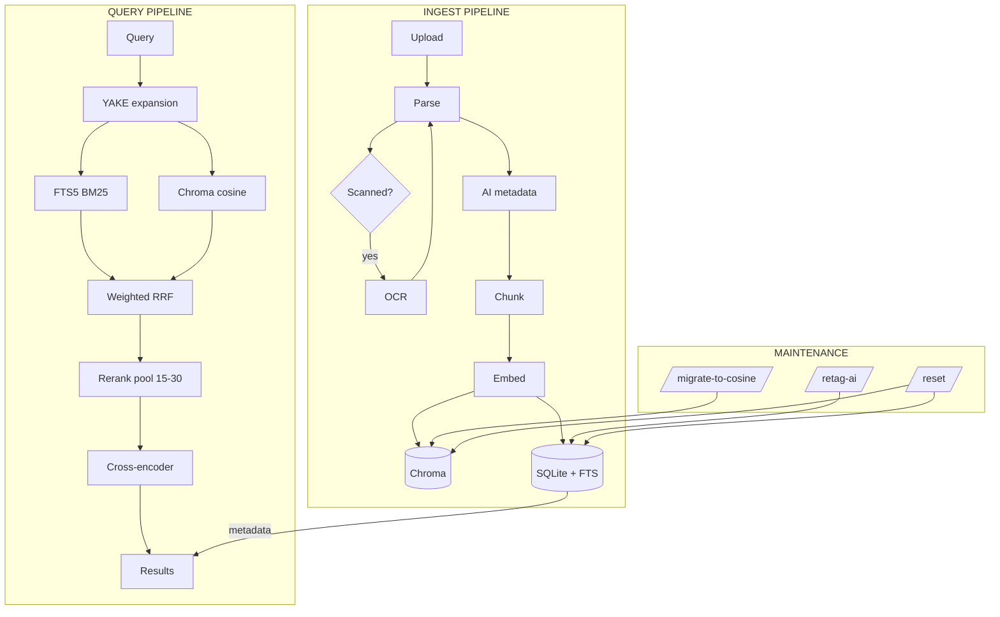
